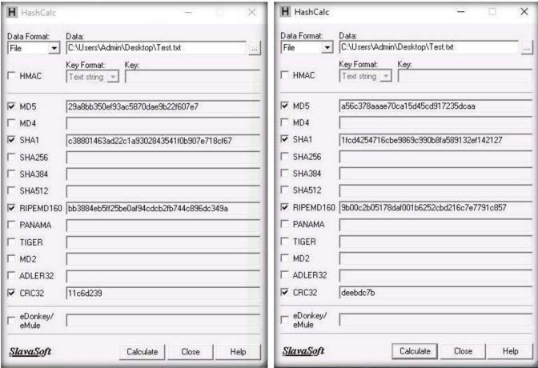

# 🟧 Burp Suite

## What is Burp Suite?

Burp Suite is a framework written in Java that aims to provide a one-stop-shop for web application penetration testing. In many ways, this goal is achieved as Burp is very much the industry standard tool for hands-on web app security assessments. Burp Suite is also very commonly used when assessing mobile applications, as the same features which make it so attractive for web app testing translate almost perfectly into testing the APIs (Application Programming Interfaces) powering most mobile apps.

At the simplest level, Burp can capture and manipulate all of the traffic between an attacker and a webserver: this is the core of the framework. After capturing requests, we can choose to send them to various other parts of the Burp Suite framework -- we will be covering some of these tools in upcoming rooms. This ability to intercept, view, and modify web requests prior to them being sent to the target server (or, in some cases, the responses before they are received by our browser), makes Burp Suite perfect for any kind of manual web app testing.

## Features

Burp Community has a relatively limited feature-set compared to the Professional edition, it still has many superb tools available. These include:

* Proxy: The most well-known aspect of Burp Suite, the Burp Proxy allows us to intercept and modify requests/responses when interacting with web applications.
* Repeater: The second most well-known Burp feature -- [Repeater](https://tryhackme.com/room/burpsuiterepeater) -- allows us to capture, modify, then resend the same request numerous times. This feature can be absolutely invaluable, especially when we need to craft a payload through trial and error (e.g. in an SQLi -- Structured Query Language Injection) or when testing the functionality of an endpoint for flaws.
* Intruder: Although harshly rate-limited in Burp Community, [Intruder](https://tryhackme.com/room/burpsuiteintruder) allows us to spray an endpoint with requests. This is often used for bruteforce attacks or to fuzz endpoints.
* Decoder: Though less-used than the previously mentioned features, [Decoder](https://tryhackme.com/room/burpsuiteom) still provides a valuable service when transforming data -- either in terms of decoding captured information, or encoding a payload prior to sending it to the target. Whilst there are other services available to do the same job, doing this directly within Burp Suite can be very efficient.\

* Comparer: As the name suggests, [Comparer](https://tryhackme.com/room/burpsuiteom) allows us to compare two pieces of data at either word or byte level. Again, this is not something that is unique to Burp Suite, but being able to send (potentially very large) pieces of data directly into a comparison tool with a single keyboard shortcut can speed things up considerably.\

* Sequencer: We usually use [Sequencer](https://tryhackme.com/room/burpsuiteom) when assessing the randomness of tokens such as session cookie values or other supposedly random generated data. If the algorithm is not generating secure random values, then this could open up some devastating avenues for attack.

## Burp Proxy

The Burp Proxy is the most fundamental (and most important!) of the tools available in Burp Suite. It allows us to capture requests and responses between ourselves and our target. These can then be manipulated or sent to other tools for further processing before being allowed to continue to their destination.

For example, if we make a request to `https://tryhackme.com` through the Burp Proxy, our request will be captured and won't be allowed to continue to the TryHackMe servers until we explicitly allow it through. We can choose to do the same with the response from the server, although this isn't active by default. This ability to intercept requests ultimately means that we can take complete control over our web traffic -- an invaluable ability when it comes to testing web applications.

<figure><figcaption></figcaption></figure>

With the proxy active, a request was made to the TryHackMe website. At this point, the browser making the request will hang, and the request will appear in the Proxy tab giving us the view shown in the screenshot above. We can then choose to forward or drop the request (potentially after editing it). We can also do various other things here, such as sending the request to one of the other Burp modules, copying it as a cURL command, saving it to a file, and many others.

When we have finished working with the Proxy, we can click the "Intercept is on" button to disable the Intercept, which will allow requests to pass through the proxy without being stopped.

We can configurate browser with proxy settings or install and configurate Foxy Proxy.

## Proxying HTTPS

Unfortunately, there's a problem. What happens if we navigate to a site with TLS enabled? For example, `https://google.com/`:\
\

<figure><figcaption></figcaption></figure>

We get an error.

Specifically, Firefox is telling us that the Portswigger Certificate Authority (CA) isn't authorised to secure the connection.

Fortunately, Burp offers us an easy way around this. We need to get Firefox to trust connections secured by Portswigger certs, so we will manually add the CA certificate to our list of trusted certificate authorities.

First, with the proxy activated head to [http://burp/cert](http://burp/cert); this will download a file called `cacert.der` -- save it somewhere on your machine.

Next, type `about:preferences` into your Firefox search bar and press enter; this takes us to the FireFox settings page. Search the page for "certificates" and we find the option to "View Certificates":\
\

<figure><figcaption></figcaption></figure>

Clicking the "View Certificates" button allows us to see all of our trusted CA certificates. We can register a new certificate for Portswigger by pressing "Import" and selecting the file that we just downloaded.

In the menu that pops up, select "Trust this CA to identify websites", then click Ok:\
\

<figure><figcaption></figcaption></figure>

We should now be free to visit any TLS enabled sites that we wish!

The following video shows the full import process:

<figure><figcaption></figcaption></figure>

## Scoping and targeting

It can get extremely tedious having Burp capturing all of our traffic. When it logs everything (including traffic to sites we aren't targeting), it muddies up logs we may later wish to send to clients. In short, allowing Burp to capture _everything_ can quickly become a massive pain.

What's the solution? Scoping.

Setting a scope for the project allows us to define what gets proxied and logged. We can restrict Burp Suite to _only_ target the web application(s) that we want to test. The easiest way to do this is by switching over to the "Target" tab, right-clicking our target from our list on the left, then choosing "Add To Scope". Burp will then ask us whether we want to stop logging anything which isn't in scope -- most of the time we want to choose "yes" here.\
\

<figure><figcaption></figcaption></figure>

We can now check our scope by switching to the "Scope" sub-tab (as shown in the GIF above).

The Scope sub-tab allows us to control what we are targeting by either _Including_ or _Excluding_ domains / IPs. This is a very powerful section, so it's well worth taking the time to get accustomed to using it.\
We just chose to disable _logging_ for out of scope traffic, but the proxy will still be intercepting everything. To turn this off, we need to go into the Proxy Options sub-tab and select "`And` `URL` `Is in target scope`" from the Intercept Client Requests section:

<figure><figcaption></figcaption></figure>

With this option selected, the proxy will completely ignore anything that isn't in the scope, vastly cleaning up the traffic coming through Burp.

In alternative to THM, another best solution to learn BurpSuite is [https://portswigger.net/web-security](https://portswigger.net/web-security)

## Cheatsheet


